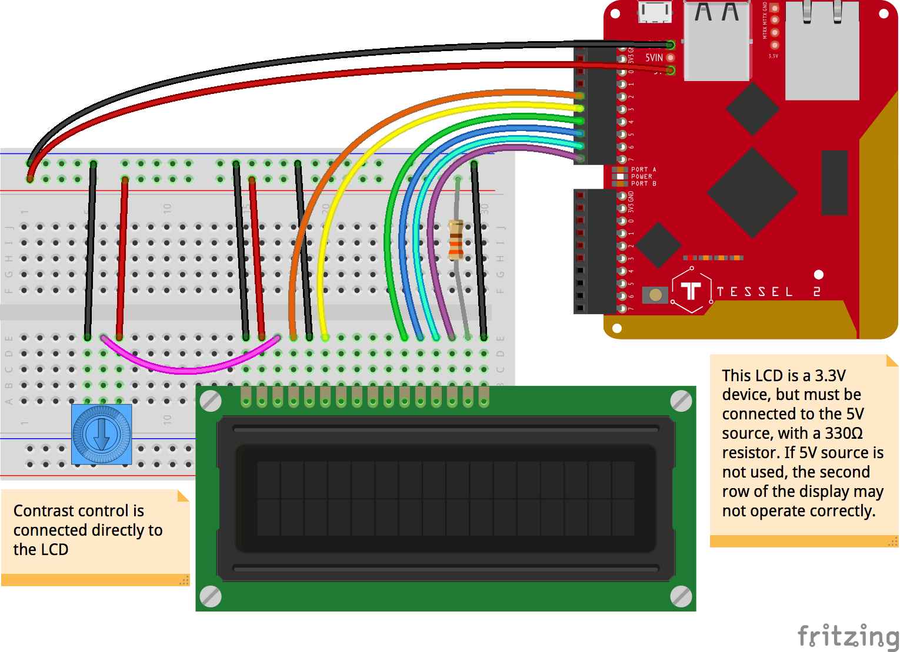

<!--remove-start-->

# LCD - Tessel 2 16x2 Runner

<!--remove-end-->


<br>

Fritzing diagram: [docs/breadboard/lcd-16x2-tessel.fzz](breadboard/lcd-16x2-tessel.fzz)

&nbsp;


Run this example from the command line with:
```bash
node eg/lcd-16x2-tessel-runner.js
```


```javascript
var five = require("johnny-five");
var Tessel = require("tessel-io");
var board = new five.Board({
  io: new Tessel()
});

board.on("ready", function() {
  var lcd = new five.LCD({
    // LCD pin:
    //      RS    EN    D4    D5    D6    D7
    pins: ["a2", "a3", "a4", "a5", "a6", "a7"],
  });

  var frame = 1;
  var frames = ["runninga", "runningb"];
  var row = 0;
  var col = 0;

  // These calls will store the "runninga" and "runningb"
  // characters in the LCD's built-in memory. The LCD
  // allows up to 8 custom characters to be pre-loaded
  // into memory.
  //
  // http://johnny-five.io/api/lcd/#predefined-characters
  //
  lcd.useChar("runninga");
  lcd.useChar("runningb");

  this.loop(300, function() {
    lcd.clear().cursor(row, col).print(
      frames[frame ^= 1]
    );

    if (++col === lcd.cols) {
      col = 0;
      if (++row === lcd.rows) {
        row = 0;
      }
    }
  });
});

```


&nbsp;

<!--remove-start-->

## License
Copyright (c) 2012, 2013, 2014 Rick Waldron <waldron.rick@gmail.com>
Licensed under the MIT license.
Copyright (c) 2016 The Johnny-Five Contributors
Licensed under the MIT license.

<!--remove-end-->
